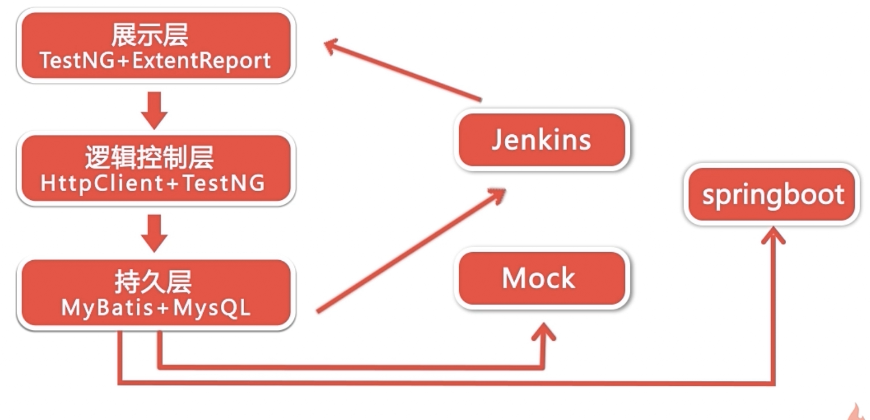

## 1-1 课程概述
做什么？ 
让你能够完全独立落地去实践的一整套自动化测试流程 
应用哪些技术？ 
HttpClient、Mock、MyBatis、TestNG、SpringBoot、Git
### 课程安排
第1-3章 课程介绍及部分概念
第4-14章 全程实战开发
第15章 课程总结
### 实战开发的主要内容

### 学习前提
掌握java的基础知识 
有一定mysql的基础，可进行增删改查的操作 
有一定的测试经验 
### 讲授方式
按照项目开发流程依次进行技术的学习 
最后进行整个自动化测试的案例完整开发 
手写每行代码 
### 课程收获
掌握课程中所涉及的全部知识点 
能够独立或带领一个组完成接口自动化测试 
### 售后服务

## 1-2 什么是接口
对外暴露统一规范； 
了解更多接口的定义，可查看慕课网《Jmeter之HTTP协议接口性能测试》
## 1-3 为什么要做接口测试
更容易实现持续集成 
自动化测试落地性价比更高，比UI更稳定 
大型系统更多更复杂，系统间模块越来越多 
bug更容易定位 
降低研发成本，提高效率 
## 1-4 接口自动化测试开发技能树
开发语言(本课程为JAVA) 
测试框架(本课程包含TestNG、HttpClient) 
Mock技术 
数据持久层框架(本课程包含MyBatis) 
持续集成工具(本课程包含Jenkins) 
接口协议相关基础知识(本课程包含HTTP协议) 
## 1-5 接口自动化测试落地过程
伴随着项目开发流程讲解 

